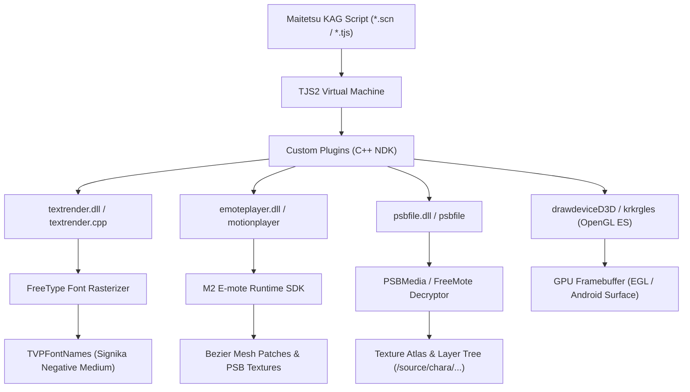

# Kiến Trúc Kỹ Thuật Chuyên Sâu: Maitetsu Last Run!! & KrKr2 Next Engine

Tài liệu kỹ thuật lưu trữ toàn bộ phân tích hệ thống, cơ chế bộ nhớ, đường ống dựng hình (rendering pipeline) và kết quả dịch ngược (reverse-engineering) các thành phần lõi của tựa game *Maitetsu: Last Run!!* trên engine **KrKr2 Next (Android / iOS / PC)**.

---

## 1. Bản Đồ Kiến Trúc Hệ Thống (System Architecture Map)



---

## 2. Phân Hệ Dựng Chữ (Text Rendering Subsystem — `textrender.cpp`)

### 2.1 Máy Trạng Thái Của Bộ Dựng Chữ (TextRender State Machine)

Module `textrender.cpp` quản lý quá trình phân tích cú pháp chuỗi kịch bản và xuất ra danh sách các ký tự `CharacterInfo` với đầy đủ tọa độ `(x, y)`, màu sắc, bóng đổ (shadow), viền (edge) và kích thước.

| Cú pháp Thẻ (Tag) | Kiểu Dữ Liệu | Chức Năng Chi Tiết Trong Engine Gốc | Xử Lý Trong C++ (`krkr2_next`) |
| :--- | :--- | :--- | :--- |
| `%l<TIPS_NAME>;` | Chuỗi định danh | Bắt đầu vùng siêu liên kết từ điển TIPS với khóa `<TIPS_NAME>`. | Đọc và bóc tách toàn bộ tên TIPS tiếng Nhật, ẩn khỏi màn hình hiển thị. |
| `%l;` | Không tham số | Kết thúc vùng liên kết TIPS. | Đóng trạng thái hyperlink, quay lại chế độ render chữ thông thường. |
| `%L` hoặc `%L;` | Lệnh canh lề | Canh lề dòng văn bản (Left / Center / Right). | Bỏ qua an toàn hoặc canh lề theo tọa độ hộp chữ. |
| `%D<time>;` | Số nguyên (`ms`) | Trì hoãn tốc độ xuất hiện của từ tiếp theo khi hiển thị thoại. | Đọc giá trị thời gian và đẩy vào mảng `m_keyWaits`. |
| `%f<name>;` | Tên phông | Chuyển đổi họ phông chữ tức thời trong dòng thoại. | Đặt `m_state.face = name`, bật cờ `m_fontDirty = true`. |
| `%b<0\|1>;` | Boolean | Bật (`1`) hoặc Tắt (`0`) chế độ in đậm (Bold). | Cập nhật `m_state.bold`, chuyển cờ sang FreeType. |
| `%i<0\|1>;` | Boolean | Bật (`1`) hoặc Tắt (`0`) chế độ in nghiêng (Italic). | Cập nhật `m_state.italic`, chuyển cờ sang FreeType. |
| `%s<size>;` | Số nguyên (`px`) | Đặt kích thước font chữ cố định. | Cập nhật `m_state.fontSize`. |
| `%<ratio>;` | Số (1-999) | Đặt kích thước font chữ theo phần trăm kích thước mặc định (`%100`, `%82`...). | `m_state.fontSize = m_default.fontSize * ratio / 100`. |
| `%e<0\|1>;` | Boolean | Bật/Tắt viền chữ. | Cập nhật `m_state.edge`. |
| `%r` | Không tham số | Đặt lại toàn bộ kiểu chữ về cấu hình mặc định ban đầu. | `m_state = m_default; m_fontDirty = true;`. |
| `#<HEX>;` | Hex 6/8 số | Đổi màu chữ theo mã màu `#RRGGBB;` hoặc `#AARRGGBB;`. | Lưu mã màu vào `m_state.chColor`, lọc bỏ alpha nếu có. |
| `#;` | Không tham số | Đặt lại màu chữ về màu mặc định (Trắng `0xFFFFFF`). | `m_state.chColor = m_default.chColor;`. |
| `\n` | Ngắt dòng | Xuống dòng mới ngay lập tức. | Gọi `flush()` và `performLinebreak()`. |
| `\i` | Thụt đầu dòng | Đặt tọa độ thụt lề cho các dòng tiếp theo `m_indent = m_x`. | Lưu vị trí thụt dòng. |
| `\w` | Khoảng trắng | Thêm một ký tự khoảng trắng `' '`. | Đẩy ký tự space vào buffer. |
| `\x` | Bỏ qua | Bỏ qua ký tự kế tiếp. | Không render ký tự điều khiển. |
| `[...]` | Ruby / Furigana | Chú thích cách đọc trên đầu chữ Hán. | Bóc tách chuỗi ruby và canh vị trí phía trên ký tự gốc. |

### 2.2 Thuật Toán Ngắt Cụm Từ Tiếng Việt (Vietnamese Word-Wrapping Algorithm)

```cpp
static bool is_word_break_char(tjs_char ch) {
    if (ch == ' ' || ch == '\t' || ch == '\n' || ch == '\r') return true;
    // CJK Ideographs, Hiragana, Katakana, Hangul, Fullwidth Punctuation
    if (ch >= 0x2E80 && ch <= 0x9FFF) return true;
    if (ch >= 0x3040 && ch <= 0x30FF) return true;
    if (ch >= 0xAC00 && ch <= 0xD7AF) return true;
    if (ch >= 0xFF00 && ch <= 0xFFEF) return true;
    return false;
}
```

* **Cơ chế hoạt động**:
  1. Các ký tự Latin và tiếng Việt có dấu được gom liên tục vào `m_buffer` thành một từ hoàn chỉnh.
  2. Khi gặp khoảng trắng hoặc ranh giới từ (`is_word_break_char == true`), hàm `flush()` tính toán tổng bề rộng của cả từ (`total_w`).
  3. Nếu `m_x + total_w > m_boxWidth` và dòng hiện tại đã có chữ (`m_x > m_indent`), hàm sẽ tự động ngắt dòng trước khi đặt từ mới.
  4. ➔ **Kết quả**: Triệt tiêu hoàn toàn lỗi xé đôi chữ cái tiếng Việt (ví dụ `b` ở cuối dòng 1 và `ánh` ở đầu dòng 2).

---

## 3. Phân Hệ Phông Chữ FreeType (`FontImpl.cpp` & `FontSystem.cpp`)

### 3.1 Đường Ống Tra Cứu Phông (Font Resolution Pipeline)

```
KAG Script Request ("Signika Negative,Signika Negative Medium" hoặc "user")
  │
  ▼
FontSystem::GetBeingFont(fonts)
  │
  ├─► Tách từng tên phông theo dấu phẩy ","
  ├─► Kiểm tra TVPFontNames.Find(fontname)
  │     ├── Có tồn tại ➔ Trả về fontname
  │     └── Không tồn tại ➔ Thử tên kế tiếp
  │
  └─► Nếu tất cả đều không khớp:
        ├── Tra cứu alias "user" ➔ Signika Negative Medium
        └── Fallback về TVPGetDefaultFontName() ➔ Signika Negative Medium
```

### 3.2 Tối Ưu Bảng Băm Tên Phông

Trong `FontImpl.cpp`, khi FreeType quét qua các file `.ttf` trong `fonts.xp3` hoặc `patch3.xp3`, hệ thống tự động đăng ký:
1. `family_name` (Ví dụ: `"Signika Negative"`).
2. `family_name + " " + style_name` (Ví dụ: `"Signika Negative Medium"`).
3. Các bí danh toàn cục: `"user"`, `"default"`, `"system"`.
4. Đảm bảo biến `TVPDefaultFontName` luôn được gán giá trị hợp lệ, không bao giờ bị rỗng `""`.

---

## 4. Phân Hệ Hoạt Ảnh E-mote & PSB (`motionplayer` & `psbfile`)

### 4.0 Giải Mã E-mote EMT Native Trong Engine (krkr2_next)

Toàn bộ nhân vật E-mote nằm trong `emotedx.xp3` dưới dạng `.psb` có cấu trúc:

```
[0x00] Wrapper E-mote: magic `\x04\x22\x4D\x18` + metadata (21 bytes)
[0x15] PSB signature "PSB\0" + version (3/4) + encrypt flag = 1
[0x1D] Header block MÃ HÓA XorShift128: 8 offset words + checksum (+3 extra words nếu v4)
[Body] Names trie / Strings / Chunks — KHÔNG mã hóa (pure body)
```

* **Thuật toán giải mã header** (`EMoteCTX.h`): stream cipher XorShift128 với
  `key = {0x075BCD15, 0x159A55E5, 0x1F123BB5, seed}`.
* **Seed của Maitetsu**: `0x174E897D` (đã brute-force + xác minh 100% trên 578 file).
* **Checksum xác thực**:
  * PSBv3: `adler32(32 byte đầu của header đã giải mã)`.
  * PSBv4: tiếp tục `adler32` trên 12 byte extra-offsets.
* **Engine tự động nhận seed** (`PSBFile::loadPSBFile`): khi TJS không gọi
  `setEmotePSBDecryptSeed`, engine thử danh sách seed biết trước và chỉ chấp nhận
  khi checksum khớp → không cần can thiệp `patch3.xp3`.
* **Lưu ý**: các file `*_タイムライン.psb` standalone là stream một phần
  (offset trỏ vượt EOF — dữ liệu string/chunk nằm ở model đi kèm); engine hiện từ chối
  an toàn các file này thay vì đọc ngoài bộ nhớ.

### 4.1 Cơ Chế Nạp Texture Model Nhân Vật

Trong tựa game *Maitetsu: Last Run!!*, toàn bộ dữ liệu nhân vật E-mote nằm trong file `emotedx.xp3` (1.11 GB) dưới dạng file nhị phân `.psb` được mã hóa bởi thuật toán FreeMote.

* **Cấu trúc cây dữ liệu PSB của Nhân vật**:
  * `/source/chara/<chara_id>/`: Chứa các mảnh bộ phận cơ thể (đầu, thân, mắt, miệng, tóc, trang phục).
  * `/motion/<chara_id>/<motion_name>`: Chứa thông tin biến dạng ma trận Bezier Patch theo thời gian.
  * `/model/<chara_id>/`: Chứa tọa độ đỉnh lưới (Mesh vertices).

* **Nguyên tắc đồng bộ giữa TJS và C++**:
  1. `AffineSourceMotion.tjs` khởi tạo `Motion.EmotePlayer` và nạp model qua `_motion_manager.resourceManager.load(storage)`.
  2. `_player.chara` được gán mã hiệu nhân vật (ví dụ: `86` cho Hachiroku, `po` cho Paulette, `hb` cho Hibiki).
  3. `Player::draw()` truy vấn `PSBMedia` để lấy danh sách layer của nhân vật và vẽ lên `targetLayer`.

---

## 5. Hướng Dẫn Tối Ưu Bộ Nhớ & Hiệu Năng (Memory & Performance Optimization)

1. **Hạn chế Allocation trong Vòng Lặp Vẽ Chữ**:
   * Tránh khởi tạo đối tượng TJS Dictionary trong các vòng lặp tính toán kích cỡ hộp thoại (`_internalRender`).
   * Sử dụng biến static/cached cho các chuỗi định danh phông chữ thường dùng.
2. **Quản lý Texture Cache của PSB**:
   * Khi chuyển cảnh kịch bản, gọi `ResourceManager.clearCache()` để giải phóng các texture của nhân vật cũ, tránh tràn bộ nhớ RAM (OOM) trên thiết bị di động 2GB/3GB RAM.
3. **Giới Hạn FPS Hợp Lý**:
   * Đối với Visual Novel tĩnh, tốc độ 45 - 60 FPS là tối ưu về mặt hình ảnh và nhiệt độ CPU/GPU.
